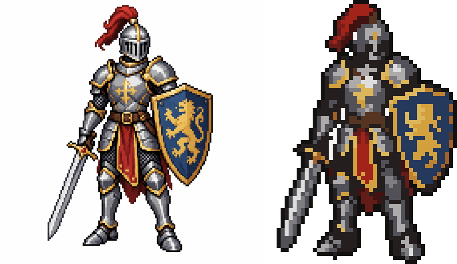
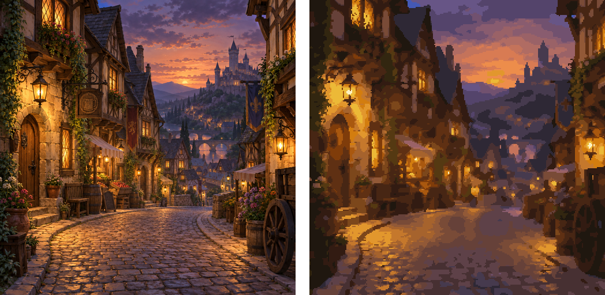

# pixelforge

[](https://github.com/colebrumley/pixelforge/actions/workflows/ci.yml)

Deterministic conversion of raster images into 16-bit-style pixel art: sprites and
backgrounds/tiles. Same input + same config = the same PNG, every run.

Three downscalers, selectable per run:

- **box** — naive mean-color baseline plus median-cut palette.
- **kopf** — content-adaptive downscaling (Kopf, Shamir, Peers; SIGGRAPH Asia 2013). Edges
  stay sharp and thin lines survive.
- **gerstner** — joint superpixel + palette optimization (Gerstner et al.; Computers &
  Graphics 2013). Segmentation and palette converge together.

Post-processing adds palette ramp regularization, selective ordered dithering, orphan-pixel
removal, jaggy cleanup, sprite outlines and optional tileset + tilemap extraction. Bundled
palettes: NES, Game Boy, Genesis, SNES, PICO-8.
Orphan removal keeps high-contrast singles such as 1-px eyes and highlights: a stray pixel is
merged only when it is within ΔE `orphan_max_delta` (default 25) of its replacement.

## Samples

Source on the left, pixelforge output on the right (nearest-neighbor upscaled).

`pixelforge convert knight.png --preset sprite --method gerstner`: 1254×1254 → 64 px on the
longest edge, 17 colors, backdrop keyed out. The canvas is exactly the requested size; the
outline is drawn inside it. (The outline adds a palette entry; with a named palette it snaps
to the nearest palette color instead.)



`pixelforge convert town.png --preset background --method gerstner`: 1254×1254 → 256×256,
32 colors, plus a tileset and tilemap.



## Install

Python 3.11+. Not published to PyPI; install straight from GitHub:

```bash
uv tool install git+https://github.com/colebrumley/pixelforge
```

or `pip install git+https://github.com/colebrumley/pixelforge`.

Optional AI background removal via `rembg`:

```bash
pip install 'pixelforge[bg] @ git+https://github.com/colebrumley/pixelforge'
```

AI matting is opt-in with `--remove-bg` (no preset enables it, installed or not). rembg
downloads its model on first use, the model is outside the determinism guarantee, and its
license is the model's own; `_meta.json` records the rembg and onnxruntime versions.

The sprite preset keys out flat opaque backdrops without it (`--no-key-bg` to disable),
including the anti-aliased fringe where the subject blends into them (`key_bg_fringe`).

To work on it:

```bash
git clone https://github.com/colebrumley/pixelforge && cd pixelforge
uv sync
uv run pytest -q
```

## CLI

```bash
pixelforge convert hero.png --preset sprite --method gerstner --palette-size 12
pixelforge convert scene.png --preset background           # writes tileset + tilemap
pixelforge batch frames/ --preset sprite                    # one shared palette for all
pixelforge compare hero.png -o out                          # box, kopf, gerstner side by side
pixelforge palettes                                         # list bundled palettes
```

Every `Config` field is a `--kebab-case` flag (`--flag/--no-flag` for booleans); `--config
file.json` loads a config. Precedence: defaults ← preset ← JSON ← flags.
`Config.replace(preset=...)` re-applies the new preset to every field not set explicitly.

`convert`, `batch` and `compare` refuse (exit 2) to write an output over an input file, and `batch`
refuses inputs that share a name (`a.png`, `a.bmp`); `--force` overrides both. `batch` skips
`*_preview`, `*_tileset` and `*_compare` images.

`--scale N` fixes the downscale ratio (output = cropped input / N per axis); `--canvas WxH` fits
the subject inside a fixed canvas, centered, outline included. Neither combines with
`--out-width/--out-height`. Unless one of them (or both `--out-*`) is given, `batch` derives one
scale from the largest frame's subject and gives every frame the same canvas, so animation
frames cropped to their alpha keep a constant size; the first JSON line reports `scale` and
`canvas`.

`--palette-name` takes a bundled name, a `.hex`/`.gpl` path, or inline colors
(`hex:ff0000,00ff00,…`). `batch` writes its shared palette to `shared_palette.hex` and hands it
to every frame inline, so the frames' metadata carries the colors, not the output path.

`convert` writes to `OUTDIR` (default `out/`):

| file | content |
| --- | --- |
| `NAME.png` | native-resolution result (palette-indexed PNG) |
| `NAME_preview.png` | nearest-neighbor upscale |
| `NAME_palette.json`, `NAME_palette.hex` | the palette (LAB rounded to 6 decimals); `.hex` is reusable via `--palette-name` |
| `NAME_meta.json` | stats, timings, config, config hash, input hash, palette, environment (Python, numpy, scipy, scikit-image, Pillow, platform; not hashed) |
| `NAME_tileset.png`, `NAME_tilemap.json` | background preset only; tiles merge when mean ΔE < `tile_dedupe_tolerance` and every pixel's ΔE < 10 (flips included) |

### Limits

Inputs larger than 24 million pixels (`width × height`) are refused before decoding; raise or
lower the budget with `--max-input-pixels N` (`max_pixels=` in `pipeline.run`). Only PNG, JPEG,
GIF, WEBP, BMP and TIFF are read, and only regular files. Numeric config fields have upper
bounds (e.g. output edges ≤ 4096, `--scale-preview` ≤ 64), and non-finite numbers are rejected.

## Library

```python
from pixelforge import Config, run

cfg = Config(preset="sprite", method="gerstner", palette_size=12, out_height=48)
res = run("hero.png", cfg)
res.save("out/hero")   # out/hero.png, hero_preview.png, hero_palette.json, ...
res.image              # numpy RGBA (H, W, 4) uint8
res.palette            # numpy (K, 3) uint8
res.indices            # (H, W) palette index, -1 = transparent
```

## Determinism

No unseeded randomness, no thread scheduling or wall-clock dependence, float64 throughout.
Each output PNG carries the canonical config JSON and the input SHA-256 as `tEXt` chunks.
`tests/test_determinism.py` enforces identical output bytes for every method and preset.
Cross-machine reproducibility additionally assumes the pinned numpy/scipy/scikit-image/Pillow
versions in `uv.lock`.

## Gallery

```bash
python scripts/gallery.py            # → gallery/index.html (about 5 minutes)
python scripts/gallery.py --quick
```

Renders every method × preset on the test fixtures plus any PNGs in `samples/`.

## More

- [DESIGN.md](DESIGN.md) — how each method works, the full determinism contract, timings,
  and every deliberate deviation from the spec.
- [REQUIREMENTS.md](REQUIREMENTS.md) — the specification the prototype was built from.

## License

MIT; see [LICENSE](LICENSE). Changes are listed in [CHANGELOG.md](CHANGELOG.md).
